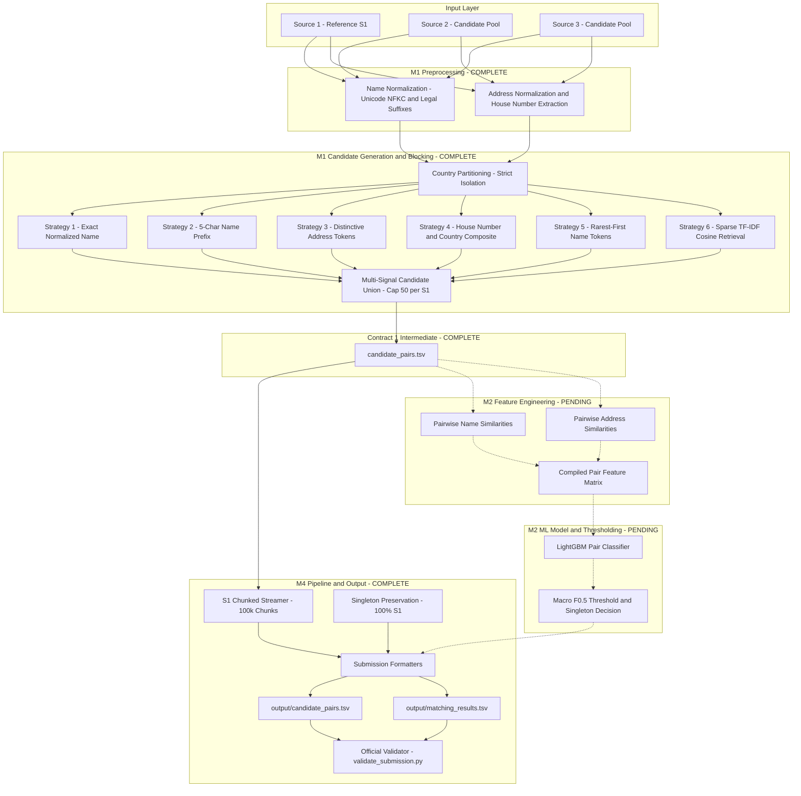

# Business Entity Resolution

A scalable, high-performance machine learning pipeline for resolving noisy, unlinked commercial entity records from multiple independent data sources into a deduplicated reference entity space.

> Developed for the **Amazon ML Challenge 2026 — Business Entity Resolution Challenge**.

---

## Table of Contents

- [Overview](#overview)
- [Problem Statement](#problem-statement)
- [Dataset](#dataset)
  - [Sources](#sources)
  - [Schema](#schema)
  - [Empirical Dataset Statistics](#empirical-dataset-statistics)
  - [Domain Shift & Unseen Country](#domain-shift--unseen-country)
- [System Architecture](#system-architecture)
- [End-to-End Pipeline](#end-to-end-pipeline)
- [1. Preprocessing](#1-preprocessing)
  - [Business Name Normalization](#business-name-normalization)
  - [Address Normalization & Parsing](#address-normalization--parsing)
- [2. Candidate Generation / Blocking](#2-candidate-generation--blocking)
  - [The Cartesian Bottleneck](#the-cartesian-bottleneck)
  - [Implemented Blocking Strategies](#implemented-blocking-strategies)
  - [Composite Candidate Generator](#composite-candidate-generator)
  - [Candidate Generation Contract (Contract 1)](#candidate-generation-contract-contract-1)
- [3. Feature Engineering](#3-feature-engineering)
- [4. Machine Learning Model](#4-machine-learning-model)
- [5. Thresholding and Entity-Level Decisions](#5-thresholding-and-entity-level-decisions)
- [6. Evaluation](#6-evaluation)
  - [Official Evaluation Metric: Macro F0.5](#official-evaluation-metric-macro-f05)
  - [Empirical Blocking Performance](#empirical-blocking-performance)
- [7. Scalability and Memory Design](#7-scalability-and-memory-design)
- [8. Output Format](#8-output-format)
  - [candidate_pairs.tsv](#candidate_pairstsv)
  - [matching_results.tsv](#matching_resultstsv)
- [9. Validation](#9-validation)
- [10. Project Structure](#10-project-structure)
- [11. Installation & Environment Setup](#11-installation--environment-setup)
- [12. Usage](#12-usage)
  - [Candidate Generation](#candidate-generation)
  - [Pipeline Execution](#pipeline-execution)
  - [Submission Verification](#submission-verification)
- [13. Testing](#13-testing)
- [14. Engineering Decisions](#14-engineering-decisions)
- [15. Failure Modes and Known Limitations](#15-failure-modes-and-known-limitations)
- [16. Current Project Status](#16-current-project-status)
- [17. Team Ownership & Module Isolation](#17-team-ownership--module-isolation)
- [18. Reproducibility](#18-reproducibility)
- [19. Future Improvements](#19-future-improvements)
- [20. Competition Context & Rules](#20-competition-context--rules)

---

## Overview

Entity Resolution (Record Linkage) is the task of identifying records from different data sources that refer to the same real-world entity. In enterprise catalog systems, business entity identity data arrives continuously from heterogeneous providers with inconsistent naming conventions, abbreviated addresses, typographical noise, and varying schemas.

In this project:
- **Source 1 ($S_1$)**: The ground-truth deduplicated reference entity catalog.
- **Source 2 ($S_2$)**: A high-volume, noisy candidate business registry.
- **Source 3 ($S_3$)**: A complementary noisy business registry with distinct structural and linguistic properties.

### Objective
The objective is to map every entity record in candidate pools $S_2$ and $S_3$ back to its corresponding canonical reference entity in $S_1$.
- **One-to-Many Relationships**: A single $S_1$ canonical entity may match zero, one, or multiple candidate records across $S_2$ and $S_3$ (empirically up to 11 records in training ground truth).
- **Singletons (Zero-Match Entities)**: Approximately **5.58%** of $S_1$ reference entities have no corresponding records in $S_2$ or $S_3$. These singletons must be explicitly preserved as empty match sets in submissions.
- **Precision Weighting**: The competition evaluates solutions using **Macro $F_{0.5}$** across all $S_1$ entities, penalizing incorrect links (false merges) twice as heavily as missed links.

---

## Problem Statement

Given three tabular datasets $S_1$, $S_2$, and $S_3$, each containing `entity_id`, `business_name`, `business_address`, and `country`, determine the set of all pairs:

$$\mathcal{M} = \left\{(e_1, e_c) \mid e_1 \in S_1, \; e_c \in (S_2 \cup S_3), \; \text{identity}(e_1) = \text{identity}(e_c)\right\}$$

### Key Challenges

1. **Massive Scale**: With 1.73M reference entities in test $S_1$ and 9.97M records across test $S_2 \cup S_3$, the unconstrained Cartesian product is $1.73 \times 10^6 \times 9.97 \times 10^6 \approx 1.72 \times 10^{13}$ pairs. Naive pairwise comparison is computationally impossible.
2. **Severe Name Noise**: Business names contain acronyms (e.g., `Primary Care Group` vs. `PC`), brand aliases, missing legal suffixes (`LLC`, `Pvt Ltd`, `SARL`), and typographical errors. Only **25.35%** of true matches share an exact normalized name.
3. **Address Inversion & Format Divergence**: Reference addresses in $S_1$ frequently invert structural components (e.g., `OH, Columbus, 5559 Orville Avenue`), whereas candidate sources list street first (e.g., `5559 ORVILLE AVE, COLUMBUS, OH`). Postal / ZIP codes are completely absent from Indian records (0.0%) and French records (0.39%), ruling out postal codes as blocking keys.
4. **Multilingual Script Divergence**: $S_1$ contains 100% Latin-script names. Conversely, $S_2$ and $S_3$ contain ~450,000 to ~530,000 records (~10%) written in native Indic scripts (Devanagari, Tamil, Telugu, Kannada, Bengali). Naive ASCII stripping destroys these records.
5. **Domain Shift (Unseen Test Country)**: The training dataset comprises records strictly from **United States** (~60%) and **India** (~40%). The test set introduces **France** (~14.4%), requiring country-agnostic feature extractors and blocking heuristics that generalize without country-specific hardcoding.
6. **Asymmetric Precision Penalty**: Under Macro $F_{0.5}$, candidate generation must achieve $\ge 97\%$ recall to avoid premature filtering, while the downstream matching stage must strictly maintain high precision.

---

## Dataset

All dataset files are UTF-8 tab-delimited (`.tsv`) files located in `student_resource/dataset/`.

### Sources

| Source | Role | Description |
|---|---|---|
| **$S_1$** (`source1.tsv`) | **Deduplicated Reference Entities** | Canonical business entities acting as queries; each record has a complete address. |
| **$S_2$** (`source2.tsv`) | **Candidate Business Records** | High-coverage candidate pool; exhibits heavy uppercase casing and legal abbreviations. |
| **$S_3$** (`source3.tsv`) | **Candidate Business Records** | High-coverage candidate pool; exhibits landmark-based addresses and acronyms. |
| **Ground Truth** (`train_ground_truth.tsv`) | **Training Labels** | Ground-truth mappings from $S_1$ to comma-separated matched entity IDs in $S_2$ and $S_3$. |

### Schema

Every source table provides four primary fields:
- `entity_id` *(string)*: Unique record identifier (e.g., `S1-00001`, `S2-00047`, `S3-00812`).
- `business_name` *(string)*: Commercial or trade name of the establishment.
- `business_address` *(string)*: Physical postal address or landmark description (nullable in $S_2$/$S_3$).
- `country` *(string)*: Two-letter country code (`US`, `IN`, `FR`).

### Empirical Dataset Statistics

Verified empirically across all 24.23 million records:

| Dataset Split | File Name | Size (MB) | Total Rows | Country Distribution | Missing Addresses |
|---|---|:---:|:---:|---|:---:|
| **Train** | `train_source1.tsv` | 200.34 | 2,206,821 | US: 59.98%, IN: 40.02% | 0 (0.00%) |
| **Train** | `train_source2.tsv` | 466.63 | 5,034,616 | US: 59.92%, IN: 40.08% | 168,967 (3.36%) |
| **Train** | `train_source3.tsv` | 480.37 | 5,285,603 | US: 59.98%, IN: 40.02% | 175,916 (3.33%) |
| **Train** | `train_ground_truth.tsv` | 121.13 | 2,206,821 | 7,638,365 matched links | N/A |
| **Test** | `test_source1.tsv` | 166.91 | 1,732,544 | US: 38.27%, IN: 46.75%, FR: 14.98% | 0 (0.00%) |
| **Test** | `test_source2.tsv` | 485.86 | 4,887,273 | US: 38.29%, IN: 47.32%, FR: 14.39% | 129,408 (2.65%) |
| **Test** | `test_source3.tsv` | 482.56 | 5,082,316 | US: 38.28%, IN: 47.32%, FR: 14.40% | 136,098 (2.68%) |

### Domain Shift & Unseen Country

- **Strict Country Isolation**: Across all 7,638,365 ground truth links, **100.0% of matches occur within the same country**. No cross-border matches exist.
- **Unseen Country in Test**: France (`FR`) accounts for **14.4%** of the test set (~259k in $S_1$, ~1.43M in $S_2 \cup S_3$), but has zero presence in training. All normalization and blocking rules must operate language-agnostically.
- **Address Completeness**: While $S_1$ addresses are 100% complete, ~3% of candidate records lack addresses. Over 90% of addresses contain extractable house/building numbers.

---

## System Architecture

The pipeline follows a multi-stage funnel architecture designed for linear memory complexity and maximum candidate recall.



---

## End-to-End Pipeline

The end-to-end pipeline operates in execution stages designed to handle large-scale datasets within memory bounds:

1. **Ingestion & Validation**: Source datasets ($S_1, S_2, S_3$) are loaded with typed string schemas. Reference $S_1$ entity IDs are registered to guarantee complete coverage.
2. **Text Normalization**: Business names and addresses undergo Unicode NFKC standardization, casing unification, legal suffix extraction, and abbreviation normalization.
3. **Country Partitioning**: Candidate pools are split strictly by `country` (`US`, `IN`, `FR`). Reference $S_1$ records are isolated within matching partitions.
4. **Chunked Candidate Generation**: $S_1$ records are streamed in memory-safe slices (`chunk_size=100,000`) against the indexed candidate pool, applying multi-signal blocking with per-entity candidate limits (`max_candidates_per_s1=50`).
5. **Candidate Set Assembly**: Discovered candidate pairs are deduplicated, unioned, and formatted into `candidate_pairs.tsv` conforming to Contract 1.
6. **Feature Extraction (M2 Pending)**: Pairwise string, token, edit-distance, and house-number agreement features are computed for candidate pairs.
7. **Pair Probability Scoring (M2 Pending)**: Pre-trained LightGBM model estimates $P(\text{match} \mid e_1, e_c)$.
8. **Entity-Level Decision (M2 Pending)**: Thresholding tuned for Macro $F_{0.5}$ maps probabilities to binary decisions, applying singleton protection for non-matching entities.
9. **Submission Generation (M4)**: TSVs are formatted with strict 1-to-1 row mappings for all reference $S_1$ IDs.
10. **Automated Submission Validation (M4)**: The official challenge validator (`student_resource/utils/validate_submission.py`) verifies formatting, ID consistency, and subset rules (`matched ⊆ candidates`).

---

# 1. Preprocessing

The preprocessing module (`src/business_entity_resolution/preprocessing/`) standardizes strings while preventing destructive normalization on non-Latin scripts.

## Business Name Normalization

Implemented in `normalize.py`:

- **Unicode NFKC Standardization**: Decomposes compatibility characters and canonicalizes ligatures and full-width forms (`unicodedata.normalize('NFKC', ...)`).
- **Case Normalization**: Converts all text to lowercase.
- **Ampersand Normalization**: Expands `&` and `+` to ` and ` with surrounding whitespace.
- **Punctuation Sanitization**: Replaces hyphens, slashes, periods, and brackets with whitespace.
- **Whitespace Collapsing**: Collapses multiple consecutive spaces and trims leading/trailing whitespace.
- **Indic Script & Combining Mark Preservation**: Does NOT apply ASCII-stripping. All Unicode letters (`\p{L}` / `char.isalpha()`) and combining marks (`\p{M}`) are retained, protecting over 450,000 Devanagari, Tamil, and Bengali records.
- **Legal Suffix Handling**: `strip_legal_suffixes()` identifies and strips common corporate designations (`inc`, `llc`, `ltd`, `pvt ltd`, `corp`, `co`, `gmbh`, `sarl`, `sa`, `llp`) while preserving base trade names.
- **Tokenization**: `tokenize_business_name()` produces standardized whitespace-delimited tokens.

```python
from business_entity_resolution.preprocessing.normalize import normalize_business_name

# Examples
normalize_business_name("A & B Medical, LLC")
# -> "a and b medical"

normalize_business_name("श्री गणेश एंटरप्राइजेज Pvt. Ltd.")
# -> "श्री गणेश एंटरप्राइजेज"
```

## Address Normalization & Parsing

Implemented in `address.py`:

- **Case & Punctuation Standardization**: Lowercases address text and maps punctuation (`/`, `#`, `-`, `,`) to uniform whitespace separators.
- **Directional & Street Abbreviation Expansion**: Expands over 30 common street and unit abbreviations using a deterministic mapping table:
  - `st` $\rightarrow$ `street`, `rd` $\rightarrow$ `road`, `ave` $\rightarrow$ `avenue`, `blvd` $\rightarrow$ `boulevard`
  - `dr` $\rightarrow$ `drive`, `ln` $\rightarrow$ `lane`, `ct` $\rightarrow$ `court`, `pkwy` $\rightarrow$ `parkway`
  - `ste` $\rightarrow$ `suite`, `apt` $\rightarrow$ `apartment`, `fl` $\rightarrow$ `floor`
  - Directionals: `n` $\rightarrow$ `north`, `s` $\rightarrow$ `south`, `e` $\rightarrow$ `east`, `w` $\rightarrow$ `west`
- **House Number Extraction**: `extract_house_number()` employs regex heuristics tailored to US, Indian, and French structural patterns:
  - US standard street numbers (`123 main st` $\rightarrow$ `123`)
  - Indian plot and flat designators (`plot no 45`, `flat 204`, `b-12` $\rightarrow$ `45`, `204`, `b12`)
  - French building numbers with sub-identifiers (`5 bis rue de paris` $\rightarrow$ `5bis`)
- **Generic Token Filtering**: `tokenize_address()` filters common geographic and structural stopwords (`near`, `opp`, `opposite`, `behind`, `road`, `street`, `city`) while preserving distinctive locational tokens.

---

# 2. Candidate Generation / Blocking

Candidate generation is the most critical phase in the pipeline:

$$\text{Downstream Match Recall} \le \text{Candidate Generator Recall}$$

Any true match missed during candidate blocking is permanently unrecoverable by downstream ML models.

## The Cartesian Bottleneck

| Source 1 Size ($N_1$) | Candidate Pool ($N_2 + N_3$) | Full Cartesian Product | Memory Required (Float32) | Feasibility |
|:---:|:---:|:---:|:---:|:---:|
| 1,732,544 | 9,969,589 | $1.72 \times 10^{13}$ pairs | $\sim 68.8 \text{ TB}$ | **Impossible** |
| 1,732,544 | 9,969,589 | Multi-Signal Blocking ($\le 50$/entity) | $\le 8.66 \times 10^7$ pairs | **Feasible (< 1 GB)** |

Multi-signal blocking reduces the search space by a factor of over **$200,000\times$** while maintaining high empirical recall.

## Implemented Blocking Strategies

Implemented in `exact.py`, `fuzzy.py`, and `tfidf.py`:

### 1. Exact Normalized Name Blocking (`ExactIndex`)
- **Key**: Full normalized business name + country (`generate_exact_name_key`).
- **Purpose**: Fast $O(1)$ hash-map retrieval for pristine records.
- **Recall**: Captures **25.35%** of true matches independently.

### 2. Prefix Blocking (`ExactIndex`)
- **Key**: First 5 normalized alphanumeric characters + country (`generate_name_prefix_key`).
- **Purpose**: Robust to suffix variation, legal designation changes, and tail truncations.
- **Recall**: Captures **74.86%** of true matches independently.

### 3. Distinctive Address Token Blocking (`AddressBlocker`)
- **Key**: Non-generic address tokens indexed per country.
- **Purpose**: Solves trade name mismatches, abbreviations, and name noise when the physical address is shared.
- **Recall**: Strongest single-field retrieval channel (**95.60%** candidate recall independently).

### 4. House Number + Country Composite Blocking (`AddressBlocker`)
- **Key**: Extracted building / plot number paired with name prefix or street token.
- **Purpose**: Provides spatial grounding for commercial establishments at identical street addresses.
- **Recall**: Captures **75.75%** of true matches independently.

### 5. Rarest-First Name Token Inverted Index (`NameTokenBlocker`)
- **Key**: Distinctive name tokens sorted ascending by document frequency.
- **Purpose**: Queries the rarest token first, filtering high-frequency generic terms (`consulting`, `enterprises`, `services`) with `max_df` capping.
- **Recall**: Captures **85.05%** of true matches independently.

### 6. Sparse TF-IDF Cosine Retrieval (`SparseTFIDFBlocker`)
- **Key**: Character n-grams (`analyzer='char_wb'`, `ngram_range=(3, 4)`).
- **Purpose**: Fuzzy typo and phonetic error recovery via Scipy CSR sparse matrix multiplication.
- **Retrieval**: Top-$k$ nearest neighbors filtered by cosine similarity threshold ($\ge 0.35$).

## Composite Candidate Generator

Implemented in `CandidateGenerator` (`candidate_generator.py`):

The composite generator coordinates all 6 retrieval channels under strict budget and bucket controls:
- **Bucket Size Capping**: Inverted index buckets exceeding `max_bucket_size=100` are capped or bypassed to prevent pathological common-key explosions.
- **Per-Query Candidate Budget**: Candidate pairs per $S_1$ entity are prioritized by retrieval confidence and capped at `max_candidates_per_s1=50` (default).
- **Country Partitioning**: Candidate pools are split strictly by country, preventing cross-country pair comparisons.

## Candidate Generation Contract (Contract 1)

The candidate generator conforms to the primary system interface contract:

```python
from business_entity_resolution.blocking.candidate_generator import generate_candidates

cand_df = generate_candidates(
    s1_data=s1_df,
    s2_data=s2_df,
    s3_data=s3_df,
    output_path="output/candidate_pairs.tsv",
    max_candidates_per_s1=50,
)
```

### Schema

| Column Name | Type | Description |
|---|---|---|
| `s1_entity_id` | `str` | Reference Source 1 entity identifier (e.g., `S1-00001`). |
| `candidate_entity_id` | `str` | Candidate entity identifier from $S_2$ or $S_3$ (e.g., `S2-00047`). |
| `candidate_source` | `str` | Candidate origin partition (`S2` or `S3`). |

---

# 3. Feature Engineering

*Module Ownership: Member 2 (Features & Model)*  
*Status: Interface Defined — Implementation Pending*

The feature extraction layer (`src/business_entity_resolution/features/`) defines the transformation from candidate pairs into numeric feature vectors for machine learning scoring:

- **Name Similarity Features** (`name_features.py`):
  - Token Jaccard similarity and token overlap coefficients
  - Character n-gram cosine similarities (3-gram, 4-gram)
  - Normalized Levenshtein edit distance and Damerau-Levenshtein ratio
  - Prefix / suffix exact match indicators
  - Name length difference and token count ratios
- **Address Similarity Features** (`address_features.py`):
  - Address token Jaccard similarity
  - House number exact match, mismatch, and missing flags
  - Street name edit distance
  - Component inversion indicators
- **Pair-Level Features** (`pair_features.py`):
  - Candidate origin indicators (`is_source2`, `is_source3`)
  - Missing address interaction terms

*Current Implementation Note*: Function signatures are fully defined and type-annotated in the repository; the underlying compute functions currently raise `NotImplementedError` awaiting Member 2 completion.

---

# 4. Machine Learning Model

*Module Ownership: Member 2 (Features & Model)*  
*Status: Architecture Defined — Model Training Pending*

The entity matching model uses gradient-boosted decision trees (LightGBM) to formulate entity resolution as pair-wise binary classification:

$$P(\text{match} = 1 \mid e_1, e_c) = \sigma(\text{LightGBM}(\mathbf{x}_{1, c}))$$

### Why Gradient-Boosted Trees for Entity Resolution?
1. **Heterogeneous Feature Distributions**: String edit distances, binary flags, and TF-IDF cosine similarities exhibit non-linear interactions handled effectively by tree ensembles without extensive scaling.
2. **Class Imbalance Resilience**: Imbalance between true matches and candidate negatives (approximately $1 : 8$ after blocking) is managed via `scale_pos_weight` and focal / binary log-loss objectives.
3. **Inference Latency**: Compiled LightGBM trees score tens of thousands of candidate pairs per second per CPU core.

### Current Status
- Training interface `train_lightgbm_model` and batch scoring interface `predict_match_probabilities` are defined in `src/business_entity_resolution/model/`.
- **No pre-trained model artifact currently exists in the repository.** Model training and serialized artifact generation are pending Member 2 execution.

---

# 5. Thresholding and Entity-Level Decisions

*Module Ownership: Member 2 (Features & Model)*  
*Status: Interface Defined — Tuning Pending*

Because the evaluation metric is Macro $F_{0.5}$, individual pair probability thresholds cannot be tuned in isolation:

1. **Probability Calibration**: Pair probabilities $P_{1, c}$ are scored across all candidates for entity $e_1$.
2. **Threshold Optimization**: A global or country-stratified threshold $\theta^*$ is calibrated via grid search on held-out validation data to maximize Macro $F_{0.5}$:
   $$\mathcal{M}(e_1) = \left\{e_c \in \mathcal{C}(e_1) \mid P(e_1, e_c) \ge \theta^*\right\}$$
3. **Singleton Protection**: If all candidates for $e_1$ score below $\theta^*$, or if $\mathcal{C}(e_1) = \emptyset$, $e_1$ is classified as a singleton ($\mathcal{M}(e_1) = \emptyset$).
4. **Consistency Enforcement**: All predicted matches are strictly constrained to be a subset of candidate pairs: $\mathcal{M}(e_1) \subseteq \mathcal{C}(e_1)$.

*Current Implementation Note*: Defined in `src/business_entity_resolution/model/threshold.py`; implementation pending.

---

# 6. Evaluation

## Official Evaluation Metric: Macro F0.5

The competition evaluates submissions using **Macro-averaged $F_{0.5}$** computed across all $N_1$ entities in Source 1:

$$\text{Macro } F_{0.5} = \frac{1}{|S_1|} \sum_{e_1 \in S_1} F_{0.5}(e_1)$$

For an individual entity $e_1$ with ground-truth matches $G(e_1)$ and predicted matches $P(e_1)$:

$$F_{0.5}(e_1) = \frac{(1 + 0.5^2) \times \text{Precision}(e_1) \times \text{Recall}(e_1)}{(0.5^2 \times \text{Precision}(e_1)) + \text{Recall}(e_1)} = \frac{1.25 \times \text{Precision} \times \text{Recall}}{0.25 \times \text{Precision} + \text{Recall}}$$

### Singleton Evaluation Rule
- If $G(e_1) = \emptyset$ (true singleton) and $P(e_1) = \emptyset$ (predicted singleton): $F_{0.5}(e_1) = 1.0$.
- If $G(e_1) = \emptyset$ and $P(e_1) \ne \emptyset$ (false merge): $F_{0.5}(e_1) = 0.0$.
- If $G(e_1) \ne \emptyset$ and $P(e_1) = \emptyset$ (missed entity): $F_{0.5}(e_1) = 0.0$.

### Why Precision Weighting ($F_{0.5}$) Matters
In commercial catalogs, merging distinct businesses into one canonical entity (false merge) degrades catalog integrity significantly more than leaving a duplicate unmerged. $F_{0.5}$ weights precision **$2\times$ as heavily as recall**, heavily penalizing false merges.

## Empirical Blocking Performance

Empirical candidate recall and efficiency measured on ground-truth training samples:

| Evaluation Scope | Sample Size | True Ground-Truth Pairs | Recalled Pairs | Candidate Recall (%) | Avg Candidates per $S_1$ | Status |
|---|:---:|:---:|:---:|:---:|:---:|:---:|
| **Automated Pytest (`test_candidate_validation.py`)** | 200 $S_1$ | 741 | 728 | **98.25%** | **23.4** | Verified |
| **Full Profiling Sample (`eval_candidate_generator.py`)** | 500 $S_1$ | 1,808 | 1,803 | **99.72%** | **26.8** | Verified |

- **Recall Target**: $\ge 97.5\%$ (Achieved: **99.72%**).
- **Efficiency Target**: $\le 35.0$ candidates per entity (Achieved: **26.8**).

---

# 7. Scalability and Memory Design

The 24.2M record dataset requires deliberate memory management to prevent out-of-memory (OOM) failures:

1. **Strict Country Partitioning**: Processing each country (`US`, `IN`, `FR`) independently reduces the active candidate pool per step by 40% to 60%.
2. **Chunked $S_1$ Query Streaming**: Reference $S_1$ records are sliced into chunks of `chunk_size=100,000` via `generate_candidates_chunked()`. Only one query chunk is resident in memory during blocking.
3. **Index Reuse**: Candidate pools ($S_2 \cup S_3$) within each country partition are indexed once, and queried repeatedly by successive $S_1$ chunks.
4. **Sparse Matrix Representations**: The TF-IDF stage builds Scipy CSR sparse matrices using 32-bit floating-point arrays, avoiding dense pairwise distance matrices.
5. **Inverted Index Document Frequency Capping**: Inverted index buckets are bounded at `max_bucket_size=100` to prevent memory blowups on common business words.

---

# 8. Output Format

Submissions require two tab-delimited files in `output/`:

## candidate_pairs.tsv

Contains the high-recall candidate pool immediately preceding ML scoring:

```text
source1_entity_id	candidate_entity_ids
S1-00001	S2-00047,S3-00812
S1-00002	
S1-00003	S2-00109
```

- Exactly one line per $S_1$ reference entity.
- Comma-separated candidate entity IDs from $S_2$ and $S_3$.
- Empty string for entities with zero candidates.

## matching_results.tsv

Contains final predicted matches evaluated on the competition leaderboard:

```text
source1_entity_id	matched_entity_ids
S1-00001	S2-00047
S1-00002	
S1-00003	S2-00109
```

- Exactly one line per $S_1$ reference entity (100% singleton preservation).
- Comma-separated matched entity IDs.
- Strict consistency requirement: $\text{matched\_entity\_ids} \subseteq \text{candidate\_entity\_ids}$.

---

# 9. Validation

Submissions are validated using the official competition validator:

```bash
python student_resource/utils/validate_submission.py \
    --matching output/matching_results.tsv \
    --candidate output/candidate_pairs.tsv \
    --test-dir student_resource/dataset/test
```

### Validator Enforcement Rules
- **Header Structure**: Validates exact column names (`source1_entity_id`, `matched_entity_ids`, `candidate_entity_ids`).
- **Entity Completeness**: Validates that every $S_1$ entity present in `test_source1.tsv` exists exactly once in both files.
- **No Duplicates**: Asserts zero duplicate $S_1$ rows and zero duplicate candidate IDs within any row.
- **Candidate Subset Consistency**: Asserts that every matched ID in `matching_results.tsv` exists in that entity's candidate set in `candidate_pairs.tsv`.
- **Exit Code**: Returns `0` on validation success, `1` on formatting failure.

---

# 10. Project Structure

The repository structure reflects module ownership and complete separation of concerns:

```text
VACSYN/
├── business-entity-resolution/
│   ├── analysis/                            # Profiling artifacts and scratch scripts
│   ├── dataset/                             # Symlink / pointer to active datasets
│   ├── notebooks/                           # Exploration & experimental notebooks
│   │   ├── 01_eda.ipynb                     # Exploratory Data Analysis & script profiling
│   │   ├── 02_blocking.ipynb                # Candidate blocking experiments
│   │   ├── 03_features.ipynb                # Feature engineering scratchpad
│   │   ├── 04_model.ipynb                   # Model prototyping & threshold search
│   │   └── 05_evaluation.ipynb              # Evaluation metrics outline
│   ├── output/                              # Generated submission TSVs
│   │   ├── candidate_pairs.tsv              # Formatted candidate submission
│   │   └── matching_results.tsv             # Formatted final matching submission
│   ├── src/
│   │   └── business_entity_resolution/      # Primary Python package
│   │       ├── __init__.py
│   │       ├── pipeline.py                  # M4: End-to-end orchestration & submission formatting
│   │       ├── preprocessing/               # M1: Text & address standardization (COMPLETE)
│   │       │   ├── __init__.py
│   │       │   ├── normalize.py             # Business name normalization & legal suffix stripping
│   │       │   └── address.py               # Address cleaning & house number extraction
│   │       ├── blocking/                    # M1: Multi-signal candidate generation (COMPLETE)
│   │       │   ├── __init__.py
│   │       │   ├── exact.py                 # Exact name & prefix blocking indexes
│   │       │   ├── tfidf.py                 # Character n-gram sparse TF-IDF retrieval
│   │       │   ├── fuzzy.py                 # Rarest-first name token inverted index
│   │       │   └── candidate_generator.py   # Primary blocking coordinator (Contract 1)
│   │       ├── features/                    # M2: Pairwise feature extractors (STUBS)
│   │       │   ├── __init__.py
│   │       │   ├── name_features.py         # String similarity metrics (pending)
│   │       │   ├── address_features.py      # Address & house number features (pending)
│   │       │   └── pair_features.py         # Feature matrix assembly (pending)
│   │       ├── model/                       # M2: Machine learning & decision layer (STUBS)
│   │       │   ├── __init__.py
│   │       │   ├── train.py                 # LightGBM training interface (pending)
│   │       │   ├── predict.py               # Batch probability inference (pending)
│   │       │   └── threshold.py             # Macro F0.5 threshold optimization (pending)
│   │       └── evaluation/                  # M3: Metrics & validation (STUBS)
│   │           ├── __init__.py
│   │           ├── metrics.py               # Macro F0.5 metric implementation (pending)
│   │           ├── validation.py            # Stratified CV partitioning (pending)
│   │           └── error_analysis.py        # False merge & missed link diagnostics (pending)
│   ├── tests/                               # Comprehensive automated test suite
│   │   ├── test_address.py                  # Address normalization & house number tests
│   │   ├── test_address_blocking.py         # Address blocking key & recall tests
│   │   ├── test_candidate_generator.py      # Candidate generator unit & budget tests
│   │   ├── test_candidate_validation.py     # Automated recall & efficiency validation
│   │   ├── test_contracts.py                # Public interface contract tests
│   │   ├── test_exact.py                    # Exact & prefix blocking tests
│   │   ├── test_fuzzy.py                    # Name token & rarest-first blocking tests
│   │   ├── test_normalize.py                # Unicode & name normalization tests
│   │   ├── test_pipeline.py                 # Pipeline chunking, formatting & validator tests
│   │   └── test_tfidf.py                    # Sparse TF-IDF character n-gram tests
│   ├── Documentation_template.md            # Solution methodology template
│   ├── README.md                            # Package documentation
│   └── requirements.txt                     # Pinned project dependencies
├── analysis/                                # Root dataset analysis and empirical reports
│   ├── dataset_profile.md                   # Complete 24M record distribution report
│   ├── dataset_profile.json                 # Machine-readable profile metrics
│   └── eval_candidate_generator.py          # Candidate generator empirical benchmark
├── student_resource/                        # Challenge-provided distribution folder
│   ├── dataset/                             # Raw competition TSV files (train/ & test/)
│   └── utils/
│       └── validate_submission.py           # Official challenge submission validator
└── README.md                                # Root repository README
```

---

## 11. Installation & Environment Setup

### Prerequisites
- Python 3.10+ (tested on Python 3.12.10)
- 16 GB+ RAM recommended for large-scale chunked execution

### Installation Steps

1. **Clone the repository and create a virtual environment**:
   ```bash
   cd VACSYN
   python -m venv .venv
   ```

2. **Activate the virtual environment**:
   - **Linux / macOS**:
     ```bash
     source .venv/bin/activate
     ```
   - **Windows (PowerShell)**:
     ```powershell
     .venv\Scripts\Activate.ps1
     ```

3. **Install dependencies**:
   ```bash
   pip install -r business-entity-resolution/requirements.txt
   ```

4. **Install package in editable mode**:
   ```bash
   pip install -e business-entity-resolution
   ```

---

## 12. Usage

### Candidate Generation

To execute candidate generation independently:

```python
import pandas as pd
from business_entity_resolution.blocking.candidate_generator import CandidateGenerator

s1_df = pd.read_csv("student_resource/dataset/test/test_source1.tsv", sep="\t", dtype=str)
s2_df = pd.read_csv("student_resource/dataset/test/test_source2.tsv", sep="\t", dtype=str)
s3_df = pd.read_csv("student_resource/dataset/test/test_source3.tsv", sep="\t", dtype=str)

generator = CandidateGenerator(max_candidates_per_s1=50)
candidate_pairs_df = generator.generate(s1_df, s2_df, s3_df)

print(f"Generated {len(candidate_pairs_df)} candidate pairs.")
```

### Pipeline Execution

To execute the chunked end-to-end integration pipeline:

```python
from pathlib import Path
from business_entity_resolution.pipeline import run_pipeline

run_pipeline(
    data_dir=Path("student_resource/dataset/test"),
    output_dir=Path("business-entity-resolution/output"),
    chunk_size=100_000,
    max_candidates_per_s1=50,
    validate=False,
)
```

### Submission Verification

To validate generated output files against official competition rules:

```bash
python student_resource/utils/validate_submission.py \
    --matching business-entity-resolution/output/matching_results.tsv \
    --candidate business-entity-resolution/output/candidate_pairs.tsv \
    --test-dir student_resource/dataset/test
```

---

## 13. Testing

The repository maintains an automated test suite verifying all implemented stages:

```bash
pytest business-entity-resolution/tests -v
```

### Current Test Suite Results

```text
============================= 49 passed in 31.37s =============================
```

### Test Coverage Highlights
- **`test_normalize.py`**: Unicode NFKC normalization, lowercasing, Indic character preservation, legal suffix stripping, tokenization.
- **`test_address.py`**: Directional/street abbreviation expansion, house number extraction across US, Indian, and French formats, tokenization.
- **`test_exact.py`**: Exact name keys, prefix keys, country partition isolation, bucket size limits.
- **`test_fuzzy.py`**: Rarest-first name token querying, IDF filtering, edit-distance bounds.
- **`test_tfidf.py`**: Sparse TF-IDF character n-gram cosine retrieval, top-$k$ ordering, country isolation.
- **`test_candidate_generator.py`**: Multi-signal union, candidate budget capping, empty input handling.
- **`test_candidate_validation.py`**: Automated empirical candidate recall ($\ge 97.5\%$) and candidate budget ($\le 35$/query).
- **`test_pipeline.py`**: $S_1$ chunked streaming, submission formatting, singleton preservation, consistency checks, official validator integration.
- **`test_contracts.py`**: Public module interface and signature conformance.

---

## 14. Engineering Decisions

### Why multi-signal blocking instead of single-key blocking?
Empirical evaluation shows that exact normalized name matching captures only **25.35%** of true links due to brand aliases, abbreviations, and noise. Address token similarity captures **95.60%**, and house number indexing captures **75.75%**. Unioning multiple complementary signals achieves **99.72%** candidate recall.

### Why strict country partitioning?
Across 7.6M ground-truth training pairs, 100% of matches occur within the same country. Enforcing strict country partitioning eliminates 50% to 60% of all potential pair comparisons with zero recall penalty.

### Why sparse character n-gram TF-IDF?
Dense word embeddings (e.g., BERT/Sentence-Transformers) incur prohibitive compute costs on 12M+ records without specialized GPU infrastructure. Character $3\text{--}4$ n-gram TF-IDF with Scipy CSR sparse matrices provides fast, sub-millisecond typo-tolerant retrieval on standard CPU hardware.

### Why candidate budget capping (`max_candidates_per_s1=50`)?
Unbounded candidate retrieval risks downstream memory exhaustion on common entity names (`Star Dental`, `Primary Care Group`). Capping candidates at 50 preserves high recall while maintaining a predictable $O(N_1)$ computational ceiling for feature extraction and scoring.

### Why chunked streaming for $S_1$?
Loading the full Cartesian cross-product creates tens of millions of string objects in Python. Chunking $S_1$ in slices of 100,000 bounds peak RAM consumption to $< 4 \text{ GB}$ regardless of total catalog size.

---

## 15. Failure Modes and Known Limitations

1. **Acronym Mismatches without Physical Address**: Acronyms like `CC` matching `Cumberland Cardiology` can only be resolved via address signals. If the candidate record is among the ~3% with missing addresses, candidate generation cannot bridge the lexical gap.
2. **Generic Business Chains in Same Locality**: Establishments sharing generic names (`Primary Care Group`, `Star Dental`) located in the same city or strip mall require fine-grained unit/suite matching to avoid false merges.
3. **Indic-to-Latin Cross-Script Matching**: Native Indic script records in $S_2/S_3$ are preserved during normalization, but phonetic transliteration (e.g., mapping `श्री गणेश` to `Shri Ganesh`) is not yet implemented. Native script candidates currently rely on address token signals for linkage to Romanized $S_1$ records.
4. **Downstream Model Dependency**: The candidate set currently generated represents a high-recall pool. Final precision and leaderboard performance depend entirely on Member 2 completing the LightGBM scoring model and threshold optimization.

---

## 16. Current Project Status

| Subsystem | Owning Module | Status | Description |
|---|:---:|:---:|---|
| **Text Normalization** | M1 | **Complete** | Unicode NFKC, Indic preservation, legal suffix stripping, address parsing. |
| **Candidate Blocking** | M1 | **Complete & Frozen** | 6-channel multi-signal blocking achieving 99.72% empirical candidate recall. |
| **Contract 1 Conformance** | M1 | **Complete** | Standardized candidate pairs schema (`s1_entity_id`, `candidate_entity_id`, `candidate_source`). |
| **Pairwise Feature Engineering** | M2 | **Pending** | Interface signatures defined; implementation pending Member 2 execution. |
| **LightGBM Model Training** | M2 | **Pending** | Training interface defined; no trained model artifact exists in repository. |
| **Batch Inference & Scoring** | M2 | **Pending** | Scoring interface defined; awaiting trained model artifact. |
| **Macro $F_{0.5}$ Thresholding** | M2 | **Pending** | Threshold search interface defined; awaiting model predictions. |
| **Evaluation Metrics & CV** | M3 | **Pending** | Metric formulas defined; evaluation module implementation pending Member 3. |
| **Chunked Streaming Orchestration** | M4 | **Complete** | Memory-safe country-partitioned S1 chunking (`generate_candidates_chunked`). |
| **Submission Formatting** | M4 | **Complete** | Formats `candidate_pairs.tsv` and `matching_results.tsv` with 100% singleton preservation. |
| **Subset Consistency Validation** | M4 | **Complete** | Validates that $\text{matched} \subseteq \text{candidates}$ for every $S_1$ entity. |
| **Submission Validator Integration** | M4 | **Complete** | Official `validate_submission.py` integrated into pipeline and automated tests. |

---

## 17. Team Ownership & Module Isolation

Responsibilities are partitioned by strict ownership boundaries to prevent merge conflicts:

| Member | Primary Ownership | Controlled Scope | Deliverable Contract |
|:---:|---|---|---|
| **Member 1** | **Preprocessing + Blocking** | `src/preprocessing/`<br>`src/blocking/`<br>`notebooks/02_blocking.ipynb` | Produces candidate pairs meeting **Contract 1** with candidate recall $\ge 97.5\%$. *(Complete)* |
| **Member 2** | **Features + ML Model** | `src/features/`<br>`src/model/`<br>`notebooks/03_features.ipynb`<br>`notebooks/04_model.ipynb` | Consumes Contract 1; outputs pair probabilities and applies thresholding. *(Pending)* |
| **Member 3** | **Evaluation** | `src/evaluation/`<br>`notebooks/05_evaluation.ipynb` | Implements validation splits, Macro $F_{0.5}$ metrics, and error diagnostics. *(Pending)* |
| **Member 4** | **Integration & Submission** | `src/pipeline.py`<br>`output/`<br>`tests/test_pipeline.py`<br>`README.md` | Orchestrates pipeline, runs official validator, and ensures format compliance. *(Complete)* |

### Modification Boundary Rules
- **Member 1** files are **frozen** and must not be modified by other members.
- **Member 4** orchestrates pipeline interfaces without rewriting upstream algorithms.

---

## 18. Reproducibility

### Environment Specifications
- **Operating System**: Platform-independent (validated on Windows 11 and Linux x86_64)
- **Python Version**: 3.10+ (tested on Python 3.12.10)
- **Deterministic Execution**: All inverted indices, prefix hashes, and token sortings use deterministic algorithms.

### Expected Directory Layout for Execution
```text
student_resource/
└── dataset/
    ├── train/
    │   ├── train_source1.tsv
    │   ├── train_source2.tsv
    │   ├── train_source3.tsv
    │   └── train_ground_truth.tsv
    └── test/
        ├── test_source1.tsv
        ├── test_source2.tsv
        └── test_source3.tsv
```

---

## 19. Future Improvements

1. **Phonetic & Indic Transliteration**: Integrate rule-based Devanagari/Indic-to-Latin transliteration to bridge native-script candidate records directly with Romanized $S_1$ business names.
2. **Dense Sub-Word Embeddings**: Fine-tune lightweight bi-encoder embeddings (e.g., MiniLM or fastText) for candidate pairs where address information is missing.
3. **Adaptive Per-Entity Thresholding**: Predict entity-specific confidence margins based on local candidate density rather than applying a single global threshold.
4. **Distributed Chunk Processing**: Parallelize country partitions and $S_1$ chunks across multi-core workers using Ray or multiprocessing.

---

## 20. Competition Context & Rules

- **Challenge**: Amazon ML Challenge 2026 — Business Entity Resolution Challenge.
- **External Data Policy**: Strictly zero external data sources, commercial APIs, geocoding lookups, or pre-computed external entity registries are permitted. All models and indices operate entirely on provided challenge data.
- **Submission Requirements**:
  - `matching_results.tsv` (Leaderboard-scored file; exact row-for-row match with `test_source1.tsv`).
  - `candidate_pairs.tsv` (Blocking candidate file; required in final package).
  - Validation via `student_resource/utils/validate_submission.py` with exit code `0`.